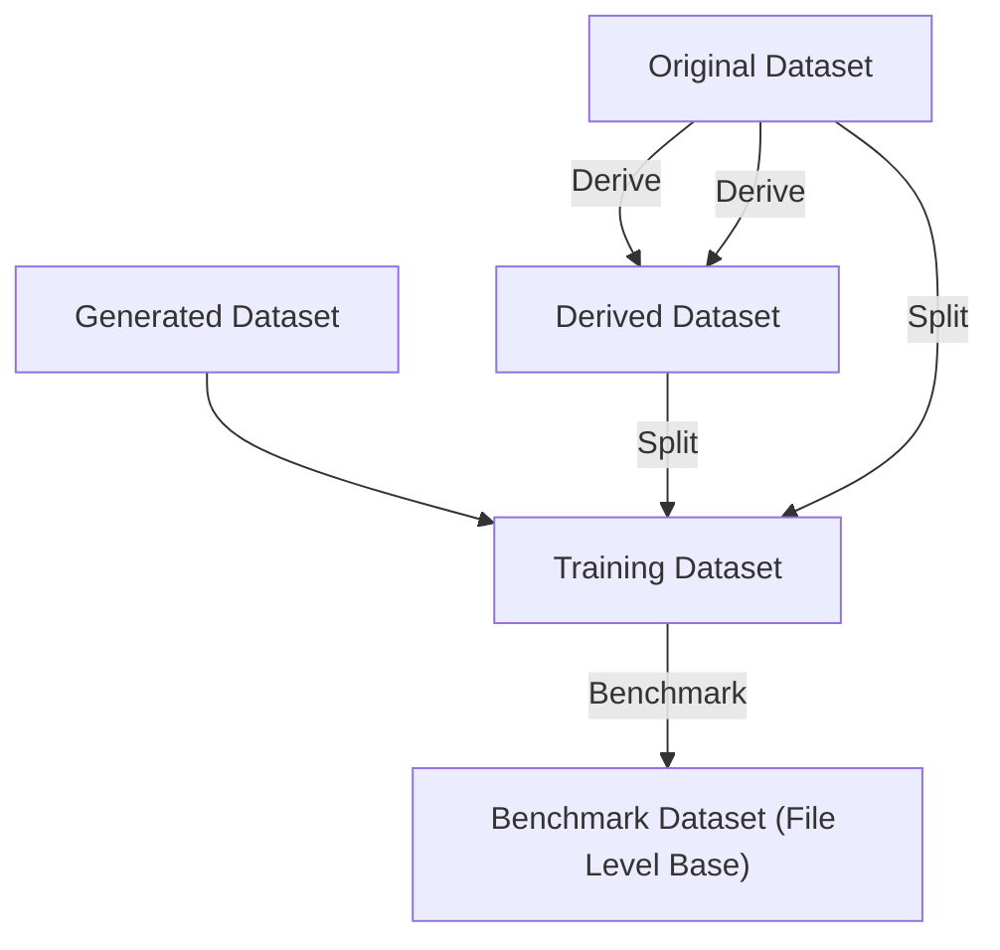

# BaseDataset

Datasets follow this structure:
We do not split the data into training and evaluation data, but instead provide the start and end of the training and evaluation data in the `dataset_info.yml` file (to make it more configurable).

```
./dataset
 | -- demands/
 |    | -- <sensorname>.csv
 | -- pressures/
 |    | -- <sensorname>.csv
 | -- flows/
 |    | -- <sensorname>.csv
 | -- levels/
 |    | -- <sensorname>.csv
 | -- leaks.csv            # Labeled Leaks
 | -- model.inp            # The water network model
 | -- dmas.json            # Layout of the district metering areas
 | -- dataset_info.yml     # Information about the dataset
```

> Note that multiple readings for the same node and sensor are not allowed.
> This is because the methods are not expected to handle in/out scenarios for flows.

The `dataset_info.yml` file contains the following information:

```yaml
name: <name of the dataset> # root name (important for )
description: <optional; description of the dataset>
inp_file: Ragnitz_Calibrated_Zones.inp
dataset: # required, start and end of evaluation and training data
  evaluation:
    end: '2016-04-12 05:12:00'
    start: '2016-04-12 01:45:00'
  training:
    end: '2016-04-12 01:45:00'
    start: '2016-04-12 01:15:00'
derivation: # Filled in by a DatasetDerivator
  <type>: <key>
source: <optional;link to source the dataset>
```

The `leaks.csv` file contains the following information:

```csv
leak_pipe_id;leak_time_start;leak_time_end;leak_time_peak;leak_area;leak_diameter;leak_flow_max,leak_flow_sum
p257;2018-01-08 13:30;2019-12-31 23:55;2018-01-25 08:30;0.1;3;0,011843
```

The `dmas.json` file contains the following information:

```json
{
  "DMA_A": {
    "pipes": [],
    "inflows": [],
    "outflows": ["LHG3879"],
    "otherSensors": ["S1"]
  }
}
```

### Derived Datasets

For testing the robustness of the leakage detection methods, we derive datasets from the original datasets.
These datasets are subject to additional noise, missing data (sensors, timespans), etc.

## Benchmark Datasets

Usage during the lifecycle of the Benchmark



Locations:

- Original Dataset: ("whereever specified")
- Generated Dataset: (`datasets/generated/xxx`)
- Derived Dataset:
- Training Dataset: (`.ldim_benchmark_cache/xxx`)
- Benchmark Dataset (File Level Base): (Specified as path to `.ldim_benchmark_cache/xxx` or copied to used place)

Wie cached man die Benchmark Daten über Threads hinweg? (Global Dictionary?)
