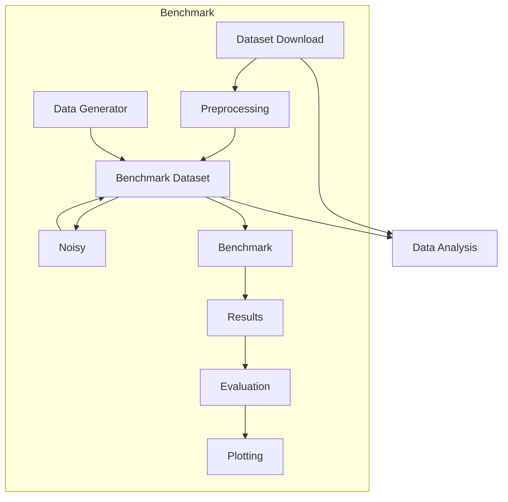

```mermaid
graph TD;
  subgraph Benchmark
    download[Dataset Download]-->preprocessing[Preprocessing];
    preprocessing-->dataset[Benchmark Dataset];
    generator[Data Generator]-->dataset;
    dataset-->dataset_noise[Noisy];
    dataset_noise-->dataset;
    dataset-->benchmark[Benchmark];

    benchmark-->results[Results];
    results-->evaluation[Evaluation];
    evaluation-->plot[Plotting];
  end
    download-->analysis[Data Analysis];
    dataset-->analysis;
```
